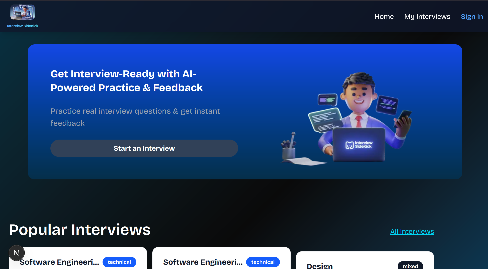

# AI Interview Preparation Platform

Interview SideKick, a sophisticated web application that helps users practice job interviews with an AI-powered interviewer, providing real-time feedback and comprehensive assessments.



## Features

### 1. AI-Powered Interview Sessions

- Real-time voice interactions with an AI interviewer
- Natural conversation flow with professional and contextual responses
- Dynamic question generation based on job role and requirements

### 2. Customizable Interview Experience

- Configure interviews based on:
  - Job role
  - Industry field
  - Required skills
  - Experience level
  - Interview type (behavioral/technical focus)
  - Number of questions

### 3. Comprehensive Feedback System

- Detailed performance assessment in key areas:
  - Communication skills
  - Technical knowledge
  - Problem-solving abilities
  - Cultural and role fit
  - Confidence and clarity
- Strengths and areas for improvement
- Actionable suggestions for enhancement
- Final assessment summary

### 4. Personal Dashboard

- Track interview history
- View all feedback reports
- Monitor progress over time
- Access interview statistics

## Technology Stack

### Frontend

- Next.js
- React
- TypeScript
- Tailwind CSS
- Shadcn UI Components

### Backend

- NextAuth.js for authentication
- Drizzle ORM for database management
- VAPI AI for voice interaction
- GPT-4 for interview intelligence
- Deepgram for speech-to-text
- Eleven Labs for text-to-speech

### Database

- Structured with Drizzle ORM
- SQL database for storing:
  - User profiles
  - Interview sessions
  - Feedback reports

## Getting Started

1. Clone the repository:

```bash
git clone https://github.com/emmamayne23/ai-interview-prep.git
```

1. Install dependencies:

```bash
npm install
```

1. Set up environment variables:

Create a `.env` file with the following variables:

```env
DATABASE_URL=your_database_url
NEXTAUTH_SECRET=your_nextauth_secret
NEXTAUTH_URL=http://localhost:3000
VAPI_API_KEY=your_vapi_api_key
```

1. Start the development server:

```bash
npm run dev
```

Visit [http://localhost:3000](http://localhost:3000) to view the application.

## Contributing

Contributions are welcome! Please feel free to submit a Pull Request.

## License

This project is licensed under the MIT License - see the LICENSE file for details.
